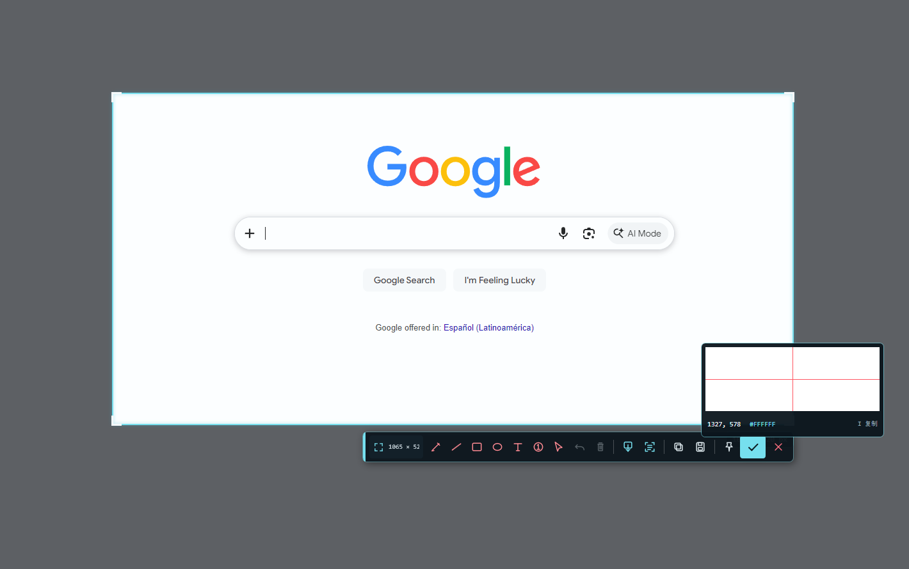
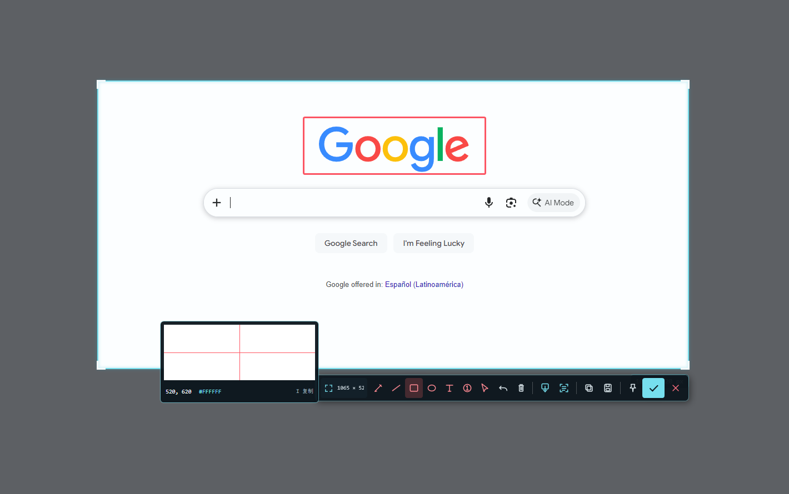
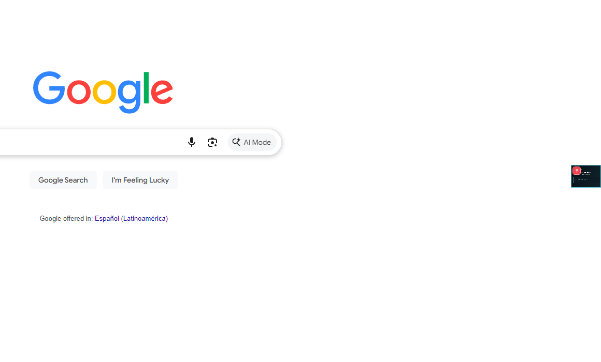

# QingSnap（轻截）

> 截得准，拼得长，贴得住；需要文字识别时，再装 OCR。
> Precise capture, reliable scrolling screenshots, flexible pins, with optional offline OCR.

QingSnap 是一款面向 Windows 10/11 的轻量截图工具，将智能选区、自动与手动长截图、专业标注、桌面贴图和截图历史整合到一套连贯的工作流中；离线 OCR 作为可选模块按需安装。

QingSnap is a lightweight screenshot utility for Windows 10/11. It combines smart capture, automatic and manual scrolling capture, annotation, desktop pins, and history in one workflow, with offline OCR available as an optional module.

[下载 Preview v47 基础包 / Download v47](https://github.com/za5132-web/QingSnap/releases/download/preview-v47/QingSnap-preview-v47.zip) · [下载 OCR 运行库模块 / OCR runtime module](https://github.com/za5132-web/QingSnap/releases/download/preview-v47/QingSnap-OCR-Module-v47.zip) · [v47 版本说明 / Release notes](https://github.com/za5132-web/QingSnap/releases/tag/preview-v47) · [完整更新日志 / Changelog](CHANGELOG.md)

| 项目 / Item | 当前状态 / Current status |
| --- | --- |
| 当前版本 / Current version | `Preview v47` |
| 支持系统 / Platform | Windows 10/11 64-bit |
| 技术基础 / Runtime | .NET 8 · WPF · Per-Monitor V2 DPI |
| OCR | 可选运行库 + PP-OCRv6 Tiny / Small 模型（离线） / optional runtime and Tiny or Small model |
| 发布形式 / Distribution | 单一基础包 + 可选 OCR 模块 / one base package plus an optional OCR module |

## 产品截图 / Product tour

### 智能选区与截图工作台 / Smart selection and capture workspace



自由框选后可继续精确调整范围，并直接使用像素放大镜、标注、OCR、长截图、复制、保存、贴图和完成截图等操作。
After selecting a region, refine its bounds and continue with the magnifier, annotation, OCR, scrolling capture, copy, save, pin, or confirm actions.

### 可继续编辑的标注 / Editable annotations



标注工具保持在选区附近，支持自由画笔、线条、箭头、形状、文字、序号、马赛克、高亮与模糊，并可继续选择和编辑对象。
Annotation tools stay close to the selection and include pen, lines, arrows, shapes, text, numbered markers, mosaic, highlight, and blur, with continued object editing.

### 桌面贴图与快捷操作 / Desktop pins and quick actions


贴图可缩放、复制、恢复 `1:1`、适应屏幕，或按 `M` 暂时收起；普通图片与长图均可使用同一套收纳逻辑。
Pins can be zoomed, copied, restored to `1:1`, fitted to the screen, or stashed with `M`; the same workflow is available for normal and long images.

### 屏幕边缘收纳 / Edge stash



收起后的贴图只在屏幕边缘露出一个缩略标签，悬停时展开，单击即可恢复到收起前的位置。
A stashed pin leaves only a thumbnail tab at the screen edge, reveals itself on hover, and returns to its previous position with one click.

## 为什么选择 QingSnap / Why QingSnap

### 1. 像素级精确截图 / Pixel-precise capture

- 鼠标悬停即可识别窗口和标准控件，单击采用智能选区。
- 也可自由框选，通过四边、四角或 `X / Y / 宽 / 高` 数值精确调整。
- 像素放大镜实时显示屏幕坐标与 HEX 颜色，按 `I` 复制当前颜色。
- 使用 `W`、`A`、`S`、`D` 将截图十字准星每次移动 1 像素。
- 按 `R` 重新载入上次选区，或用 `Shift+F1` 直接重复上次截图范围。

- Detect windows and standard controls under the pointer, then click to use the suggested region.
- Draw a free region or refine it from every edge and corner, including exact `X / Y / width / height` input.
- Inspect coordinates and HEX colors in the live pixel magnifier; press `I` to copy the current color.
- Nudge the crosshair one pixel at a time with `W`, `A`, `S`, and `D`.
- Reload the previous region with `R`, or repeat it directly with `Shift+F1`.

### 2. 自动与手动长截图 / Automatic and manual scrolling capture

- 自动滚动、等待画面稳定、分析重叠区域并拼接长图。
- 检测页面底部并自动停止；也可按 `Enter` 提前结束。
- 匹配失败时返回最后成功位置，缩小滚动步长后重试。
- 支持回退最后一屏并重新补截，动态或不规则页面可切换为手动逐屏模式。
- 可识别稀疏页面中的固定标题栏和底部操作栏，避免在最终长图中重复出现。
- 长图贴图自动进入阅读窗，支持滚轮浏览、阅读进度、回到顶部和完整概览。

- Scroll automatically, wait for visual stability, analyze overlap, and stitch each frame.
- Detect the bottom of the page and stop automatically, or finish early with `Enter`.
- Return to the last successful position and retry with a smaller scroll step when matching fails.
- Undo the latest frame and recapture it, or use manual frame-by-frame mode for animated and irregular pages.
- Detect fixed headers and bottom action bars on sparse pages so they appear only once in the final image.
- Open long pins in a dedicated reader with wheel navigation, progress, jump-to-top, and full overview.

### 3. 按需安装的本地 OCR / Optional offline OCR

- 基础包默认不安装 OCR，截图、长截图、标注、贴图和历史功能不受影响。
- 设置页可独立安装或卸载 OCR 运行库，并选择 PP-OCRv6 Tiny（约 7.4 MB）或 Small（约 30.8 MB）。
- 选择模型后点击一次即可自动下载、安装和校验运行库与模型，不需要手动寻找 ZIP。
- Tiny 更轻、更快；Small 更适合复杂中文和混排页面，两种模型可按需切换。
- OCR 引擎会在程序空闲时预热，并直接读取截图像素；同一图片的结果可复用。
- 普通贴图和长图贴图都可直接拖选文字，按 `Ctrl+C` 复制选中内容。
- OCR 结果窗口支持重新识别和一键复制全文。

- The base package ships without OCR; capture, scrolling capture, annotation, pins, and history remain fully available.
- Install or remove the OCR runtime independently in Settings, then choose PP-OCRv6 Tiny (about 7.4 MB) or Small (about 30.8 MB).
- Select a model and install the runtime and model in one click, with no ZIP browsing or extraction.
- Tiny favors size and speed; Small favors complex Chinese and mixed-layout accuracy, and models can be switched on demand.
- Preheat OCR while the app is idle, read screenshot pixels directly, and reuse results for the same image.
- Select text directly inside both normal and long-image pins, then copy it with `Ctrl+C`.
- Retry recognition or copy all text from the OCR result window.

### 4. 可继续编辑的截图标注 / Editable annotation workflow

- 提供自由画笔、直线、单头/双头箭头、矩形、椭圆、文字、序号、马赛克、高亮与区域模糊。
- 自定义颜色、线条粗细和文字大小，并可在设置中保存默认样式。
- 标注对象支持选择、移动、缩放、调整端点、复制粘贴和删除。
- 文字可二次编辑，图层可前移、后移、置顶或置底。
- 支持撤销单步操作或清空全部标注。

- Draw with a freehand pen, lines, single/double arrows, rectangles, ellipses, text, numbered markers, mosaic, highlight, and blur.
- Customize colors, stroke width, and text size, with reusable defaults in Settings.
- Select, move, resize, adjust endpoints, copy, paste, or delete annotation objects.
- Re-edit text and move objects forward, backward, to front, or to back.
- Undo the latest operation or clear every annotation.

### 5. 可以收纳到屏幕边缘的贴图 / Pins that stay out of the way

- 按 `F3` 贴出剪贴板图片；剪贴板没有图片时会使用最近一次截图。
- 普通贴图支持拖动、滚轮缩放、适应屏幕、`1:1` 原始大小和再次复制。
- 按 `M` 将普通或长图贴图暂存为屏幕侧边缩略标签，再次按 `M` 或单击即可原位恢复。
- 缩略标签自动靠近最近的屏幕边缘，平时仅露出提示条，鼠标悬停时展开。
- 将展开的贴图拖到屏幕左侧或右侧松开，可通过动画直接缩成当前位置的缩略窗。
- 完整贴图与缩略标签的位置分别记忆，不打断当前桌面布局。

- Press `F3` to pin a clipboard image, or use the latest capture when the clipboard has no image.
- Move, wheel-zoom, fit, view at `1:1`, and recopy normal pins.
- Press `M` to stash normal or long-image pins as edge thumbnails; press `M` again or click to restore them in place.
- Let thumbnail tabs snap to the nearest screen edge, peek while idle, and reveal on hover.
- Drag an expanded pin to the left or right screen edge and release it to collapse with animation.
- Keep expanded and docked positions independently so the desktop layout remains predictable.

### 6. 截图历史与桌面工作流 / History and desktop workflow

- 截图可自动复制并保存到历史记录。
- 历史窗口提供虚拟化缩略图、日期/长图/收藏筛选、OCR 文字搜索、刷新与打开记录目录。
- 每张历史图片都可贴图、OCR、打开、复制或删除。
- 支持 PNG、JPG、BMP 输出，可设置 JPG 质量、记录目录和自动清理天数。
- 系统托盘可启动区域截图、自动/手动长截图、重复上次范围、贴图、历史和设置。
- 系统托盘可导出本地诊断包；日志只保留 7 天，并且不包含截图或 OCR 正文。
- 单实例运行，可选择登录 Windows 后自动启动。

- Copy captures automatically and keep them in screenshot history.
- Browse virtualized thumbnails; filter by date, long captures, or favorites; search recognized text; refresh; or open the history directory.
- Pin, OCR, open, copy, or delete any saved image.
- Save as PNG, JPG, or BMP, with configurable JPG quality, history location, and retention period.
- Start region capture, automatic/manual scrolling capture, repeat capture, pins, history, and Settings from the system tray.
- Run as a single instance and optionally start with Windows.

## Preview v47 改进 / What’s new in Preview v47

- 不再区分精简包和完整版：所有用户使用同一个无 OCR 基础包。
  Lite and Full editions are replaced by one OCR-free base package.
- OCR 运行库成为可独立安装、重装和卸载的模块；Tiny 与 Small 模型也可分别下载和切换。
  The OCR runtime can be installed, replaced, or removed independently, with separately downloadable Tiny and Small models.
- 设置页用“运行库 → 模型 → 可用”状态链展示安装进度；未安装 OCR 时不会后台预识别。
  Settings shows a runtime-to-model-to-ready status chain, and the app performs no background recognition when OCR is absent.

## Preview v46 改进 / What’s new in Preview v46

- 截图完成通知改为不抢焦点、不进入 Windows 通知中心的轻量自绘浮窗，并支持多显示器与系统“减少动画”。
  Capture completion now uses a focus-free custom toast instead of a Windows notification, with multi-monitor and reduced-motion support.
- 图片复制拆分为“立即发布”和“持久化”两个阶段；剪贴板短暂被占用时会自动恢复，不再把已经保存的截图判为失败。
  Image copy now separates immediate publication from persistence, automatically recovering from temporary clipboard contention without treating a saved capture as failed.
- 剪贴板写入最多按时间恢复 15 秒，并在诊断日志中记录恢复耗时及持续占用进程。
  Clipboard writes now recover for up to 15 seconds and log recovery time and the process responsible for prolonged contention.
- 截图即使遇到长期剪贴板占用也会正常进入历史记录，浮窗会明确显示“截图已保存”。
  Captures still complete and enter history during prolonged clipboard contention, with a clear saved-state toast.

## Preview v45 优化 / What’s new in Preview v45

- 长截图只保留最近 3 个撤销检查点，生成最终图片时不再分配一份完整的中间像素数组。
  Scrolling capture now keeps only the three latest undo checkpoints and writes the final bitmap without allocating a second full-size pixel buffer.
- OCR 新增“极速后台预热”和“节能闲置释放”，并可跨图片对象复用内容缓存。
  OCR adds instant background warm-up, energy-saving idle release, and content-based result reuse across image objects.
- 高精度 OCR 拆分为可选扩展，轻量包仍可使用完整截图、贴图、长截图与 Windows OCR。
  High-accuracy OCR is now an optional extension; the Lite package retains capture, pinning, scrolling capture, history, and Windows OCR.
- 剪贴板重试迁移到独立 STA 队列，系统剪贴板被占用时不再阻塞截图界面。
  Clipboard retries now run on a dedicated STA queue, so a busy system clipboard no longer freezes the capture interface.
- 历史记录新增收藏、长图筛选和已识别文字搜索，并启用回收式界面虚拟化。
  History adds favorites, long-capture filtering, recognized-text search, and recycling virtualization.
- 新增滚动拼接、缓存释放、贴图停靠、设置归一化、OCR 缓存和历史索引自动测试。
  Added automated coverage for scrolling assembly, cache release, pin docking, settings normalization, OCR caching, and the history text index.

[阅读 v45 优化报告 / Read the v45 optimization report](docs/V45_OPTIMIZATION_REPORT.md)

## Preview v44 新功能 / What’s new in Preview v44

- `M` 键收起贴图、屏幕边缘缩略停靠、悬停展开与动画恢复。
- 可将展开的贴图直接拖到屏幕侧边收起，并分别记忆两种窗口位置。
- 新增可选 `X` 关闭按钮；截图工具栏常驻显示，贴图按钮自动渐隐。
- 新增 `WASD` 十字准星 1 像素微调。
- 优化截图转贴图首帧、滚轮缩放、中文输入法快捷键与高 DPI 显示。

- Stash pins with `M`, dock them as edge thumbnails, reveal on hover, and restore with animation.
- Collapse an expanded pin by dropping it at a screen edge while preserving both window positions.
- Enable optional `X` close buttons on the capture toolbar and pinned images.
- Nudge the capture crosshair one pixel at a time with `WASD`.
- Improved capture-to-pin presentation, wheel zoom, IME-safe shortcuts, and high-DPI behavior.

[阅读完整 Preview v44 更新说明 / Read the full Preview v44 release notes](https://github.com/za5132-web/QingSnap/releases/tag/preview-v44)

## 完整版本历程 / Complete version history

下表按实际开发顺序记录 v1–v47。标记为“内部迭代”的版本曾生成本地测试包，但很快被后续版本替代。

The table follows the actual v1–v47 development sequence. Builds marked “internal iteration” were local test packages quickly superseded by later versions.

| 版本 / Version | 日期 / Date | 本次更新 / Changes |
| --- | --- | --- |
| v47 | 2026-08-25 | 统一为无 OCR 基础包；设置页一键安装/卸载 OCR 运行库与 Tiny/Small 模型；修复 Tiny 字典乱码和英文选区空格；新增多尺寸程序图标。<br>Unified the OCR-free base package; added one-click runtime and Tiny/Small model management; fixed Tiny dictionary decoding and selection spacing; added multi-size app icons. |
| v46 | 2026-08-25 | 用屏幕中央自绘浮窗替代 Windows 通知；剪贴板改为最长 15 秒后台恢复，截图保存不再受复制失败影响。<br>Replaced Windows notifications with centered custom toasts; added up to 15 seconds of background clipboard recovery and decoupled history saving from copy failures. |
| v45 | 2026-08-25 | 拆分可选高精度 OCR 扩展，优化长截图内存、OCR 缓存、历史检索与诊断，并新增 13 项测试。<br>Split high-accuracy OCR into an optional extension; optimized scrolling-capture memory, OCR caching, history search, diagnostics, and added 13 tests. |
| v44 | 2026-08-24 | 修复贴图侧边缩略窗四角黑边，完成缩略停靠交互的公开版收尾。<br>Fixed black corners on docked pin thumbnails and polished the public edge-stash release. |
| v43 | 2026-08-24 | 新增 `WASD` 逐像素准星、输入法安全快捷键，以及贴图侧边缩略、悬停展开、拖拽吸附和位置记忆。<br>Added pixel-by-pixel `WASD` crosshair control, IME-safe shortcuts, edge thumbnails, hover reveal, drag docking, and position memory. |
| v42 | 2026-08-24 | 让 Per-Monitor V2 DPI 真正生效，贴图改为中心锚定和线性采样，重写缩放稳定性。<br>Activated Per-Monitor V2 DPI correctly and rewrote pin scaling around a fixed center with linear sampling. |
| v41 | 2026-08-24 | 移除缩放时低清/高清二次重绘，统一设备像素对齐，减少不规律回弹。<br>Removed low/high-quality redraw switching and aligned window, border, and image to device pixels. |
| v40 | 2026-08-24 | 取消弹簧惯性动画，每格滚轮只提交一次尺寸变化，并锁定鼠标下图像锚点。<br>Removed spring-like inertia, applied one resize per wheel step, and locked the image point under the cursor. |
| v39 | 2026-08-24 | 贴图改为后台预绘制、一次显现，并与截图蒙层同帧交接，消除截图转贴图闪烁。<br>Pre-rendered pins before a same-frame handoff from the capture overlay, eliminating capture-to-pin flashing. |
| v38 | 2026-08-24 | `Esc` 始终可关闭；设置可额外显示截图工具栏和贴图的 `X`，并固定工具栏顺序。<br>Kept `Esc` always available while optionally showing `X` buttons on the capture toolbar and pins. |
| v37 | 2026-08-24 | 内部迭代：加入可选关闭按钮、贴图阻尼缩放和蒙层退场方案。<br>Internal iteration: introduced optional close buttons, damped pin scaling, and overlay-transition experiments. |
| v36 | 2026-08-24 | 内部迭代：把贴图尺寸更新移到布局前，修复缩放黑框，并改进截图与贴图交接。<br>Internal iteration: moved resize updates before layout, fixed black scaling borders, and improved capture-to-pin handoff. |
| v35 | 2026-08-24 | 内部迭代：首次尝试合并连续滚轮输入和优化贴图首帧呈现。<br>Internal iteration: first pass at coalesced wheel input and improved first-frame pin presentation. |
| v34 | 2026-08-23 | 截图阶段预识别并在贴图复用结果；贴图文字可直接拖选，空白区域仍可拖动图片。<br>Prefetched OCR during capture and reused it in pins; enabled direct text selection while preserving drag behavior on blank areas. |
| v33 | 2026-08-23 | OCR 直接读取像素、缓存同图结果、后台预热，并限制推理线程与内存池。<br>Fed pixels directly into OCR, cached repeated results, warmed the engine in the background, and limited inference threads and memory pools. |
| v32 | 2026-08-23 | 内部迭代：按 CPU 核心数控制 OCR 推理线程，补充性能/内存基准与压缩包验证。<br>Internal iteration: tuned OCR threads to CPU cores and added performance, memory, and packaging measurements. |
| v31 | 2026-08-23 | 内部迭代：选区稳定后提前 OCR，先显示快速结果，再无闪烁替换为高精度结果。<br>Internal iteration: prefetched OCR for stable selections and staged fast results before high-accuracy replacement. |
| v30 | 2026-08-23 | 标注支持控制框、缩放节点、线条端点、文字二次编辑、右键菜单和图层顺序。<br>Added annotation handles, endpoint editing, text re-editing, context actions, and layer ordering. |
| v29 | 2026-08-22 | OCR 进度缩为自动淡出的状态点，贴图文字统一用 `Ctrl+C` 复制并保留失败选区。<br>Condensed OCR progress into a fading status indicator and standardized pin-text copying on `Ctrl+C`. |
| v28 | 2026-08-22 | 文字复制改用原生 Unicode 剪贴板接口，并加强文字、图片和颜色复制重试。<br>Moved text copying to the native Unicode clipboard API and hardened text, image, and color retries. |
| v27 | 2026-08-22 | 接入 PP-OCRv6 Small 高精度离线 OCR，支持模型下载、校验、删除和 Windows OCR 回退。<br>Integrated offline PP-OCRv6 Small with model download, verification, removal, and Windows OCR fallback. |
| v26 | 2026-08-22 | 普通贴图和长图贴图新增文字识别、点选/拖选/整行选择及缩放滚动坐标跟随。<br>Added OCR text picking, drag selection, line selection, and coordinate tracking in normal and long-image pins. |
| v25 | 2026-08-22 | 合并矩形/区域效果与直线/箭头工具，支持箭头端点调整，并缩短工具栏。<br>Grouped shape/effect and line/arrow tools, added arrow endpoint editing, and shortened the toolbar. |
| v24 | 2026-08-22 | 标注工具点击即弹六色面板；悬停标注时滚轮可调整线宽、字号和序号大小。<br>Added contextual six-color palettes and wheel adjustment for stroke width, text size, and marker size. |
| v23 | 2026-08-22 | 移除取消按钮，将贴图放在确认左侧、确认固定最右，继续使用 `Esc`/右键取消。<br>Removed the cancel button, placed Pin before Confirm, kept Confirm last, and retained `Esc`/right-click cancellation. |
| v22 | 2026-08-21 | 修复绘制工具激活后光标不能立即变为十字的问题，并保留选择工具的移动光标。<br>Fixed immediate crosshair cursor feedback for drawing tools while preserving move feedback in Select mode. |
| v21 | 2026-08-20 | 保存设置后窗口保持打开，显示成功状态并立即应用，关闭/取消时才退出。<br>Kept Settings open after saving, showed success feedback, and applied changes immediately. |
| v20 | 2026-08-20 | 修复设置窗口保存时的 `DialogResult` 错误，确保快捷键与托盘配置即时刷新。<br>Fixed the Settings `DialogResult` error and ensured hotkeys and tray configuration refreshed immediately. |
| v19 | 2026-08-20 | 设置页改为统一深色自绘窗口；修复稀疏页面长截图重复拼接底部固定栏。<br>Redesigned Settings as a consistent dark custom window and fixed repeated fixed footers on sparse scrolling pages. |
| v18 | 2026-08-20 | 工具栏统一矢量图标和状态色，新增 QingSnap 托盘图标并优化拾色器信息布局。<br>Unified toolbar vector icons and state colors, added a QingSnap tray icon, and improved magnifier information layout. |
| v17 | 2026-08-20 | 完成设置中心、智能选区、像素放大镜、精确坐标输入和扩展标注工具，并修复 1×1 误选区。<br>Completed Settings, smart selection, pixel magnifier, exact coordinates, expanded annotations, and fixed accidental 1×1 regions. |
| v16 | 2026-08-20 | 内部迭代：首次整合设置持久化、智能选区、取色、延时截图和更多标注工具。<br>Internal iteration: first integrated settings persistence, smart selection, color picking, delayed capture, and expanded annotations. |
| v15 | 2026-08-20 | 新增 `F3` 贴剪贴板/最近截图、`R` 恢复上次选区，并优化贴图初始位置。<br>Added `F3` pinning from clipboard/latest capture, `R` region recall, and smarter initial pin placement. |
| v14 | 2026-08-20 | 长图贴图新增阅读窗、进度轨、阅读/概览切换、缩放与横向浏览。<br>Added a long-image reader, progress track, reader/overview toggle, zoom, and horizontal navigation. |
| v13 | 2026-08-20 | 长截图匹配失败时回到最后成功位置、缩小步长重试，并支持撤销最后一屏。<br>Returned to the last successful scroll position on mismatch, retried with smaller steps, and added last-frame undo. |
| v12 | 2026-08-20 | 新增画笔、箭头、矩形、文字、马赛克、撤销与清空，并改进贴图锚点缩放。<br>Added pen, arrow, rectangle, text, mosaic, undo, and clear actions, plus improved anchored pin scaling. |
| v11 | 2026-08-20 | 重做深色贴图右键菜单，移除白色图标槽并优化宽度、分隔线、阴影和悬停。<br>Rebuilt the dark pin context menu without the white icon gutter and refined spacing, separators, shadows, and hover. |
| v10 | 2026-08-20 | 长截图保留穿透式选区蒙层；贴图按原区域出现，操作移入右键菜单。<br>Kept a click-through capture overlay during scrolling; opened pins at the source region and moved actions into the context menu. |
| v9 | 2026-08-20 | 重写长截图匹配：排除固定栏、使用真实位移和置信度、可靠判断到底，并修复历史保存。<br>Rewrote scrolling matching with fixed-bar exclusion, real displacement, confidence checks, robust bottom detection, and history saving. |
| v8 | 2026-08-19 | 选区旁新增工具栏与长图/OCR/贴图/复制/保存入口，长截图显示实时状态。<br>Added a region-adjacent toolbar with scrolling capture, OCR, pin, copy, and save actions plus live scrolling status. |
| v7 | 2026-08-19 | 新增自动滚动、画面稳定采样、自适应速度、到底检测和手动补截回退。<br>Added automatic scrolling, stable-frame sampling, adaptive speed, bottom detection, and manual fallback capture. |
| v6 | 2026-08-19 | 实现手动逐屏长截图、重叠匹配、重复帧拦截和安全尺寸限制。<br>Implemented manual frame-by-frame scrolling capture, overlap matching, duplicate rejection, and safe size limits. |
| v5 | 2026-08-19 | 接入 Windows 本地 OCR，新增识字入口、原图/文本校对窗口、重新识别和复制全文。<br>Integrated local Windows OCR with recognition actions, image/text review, retry, and copy-all. |
| v4 | 2026-08-19 | 新增多贴图、置顶、拖动、滚轮缩放、适屏/1:1、复制与关闭操作。<br>Added multiple always-on-top pins with dragging, wheel zoom, fit/1:1, copy, and close actions. |
| v3 | 2026-08-19 | 修复双击确认；上次选区可继续编辑；新增带缩略图、搜索、筛选和操作的历史窗口。<br>Fixed double-click confirmation, made previous regions editable, and added a thumbnail history window with search, filters, and actions. |
| v2 | 2026-08-19 | 内部迭代：首次加入可编辑上次选区和截图历史 UI，随后由 v3 修复并取代。<br>Internal iteration: first editable region recall and history UI, superseded by the corrected v3 build. |
| v1 | 2026-08-19 | 首个可运行版本：区域截图、重复范围、自动复制、历史保存、托盘、单实例和多 DPI。<br>First runnable build with region capture, repeat region, automatic copy, history storage, tray support, single instance, and multi-DPI awareness. |

[查看独立更新日志 / Open the standalone changelog](CHANGELOG.md) · [版本档案说明 / Version archive notes](docs/VERSION_ARCHIVE.md)

## 快速开始 / Quick start

1. 从 [Releases](https://github.com/za5132-web/QingSnap/releases) 下载最新 ZIP，并解压到任意文件夹。
2. 运行 `QingSnap.exe`，程序会常驻系统托盘。
3. 按 `F1` 截图，按 `F3` 贴图；右键托盘图标可进入长截图、历史记录与设置。

1. Download the latest ZIP from [Releases](https://github.com/za5132-web/QingSnap/releases) and extract it anywhere.
2. Run `QingSnap.exe`; the app stays available in the system tray.
3. Press `F1` to capture or `F3` to pin. Right-click the tray icon for scrolling capture, history, and Settings.

> 当前预览版尚未进行代码签名，Windows 首次运行时可能显示未知发布者提示。
> The current preview is unsigned, so Windows may show an unknown-publisher warning on first launch.

## 快捷键 / Shortcuts

### 全局与截图 / Global and capture

| 操作 / Action | 快捷键 / Shortcut |
| --- | --- |
| 区域截图 / Region capture | `F1` |
| 贴出剪贴板图片或最近截图 / Pin clipboard image or latest capture | `F3` |
| 重复上次截图范围 / Repeat the previous capture region | `Shift+F1` |
| 微调截图十字准星 / Nudge the capture crosshair | `W` `A` `S` `D` · 1 px |
| 载入上次选区 / Reload the previous selection | `R` |
| 复制当前 HEX 颜色 / Copy current HEX color | `I` |
| OCR / Recognize text | `Ctrl+O` |
| 复制选区 / Copy selection | `Ctrl+C` |
| 保存选区 / Save selection | `Ctrl+S` |
| 撤销标注 / Undo annotation | `Ctrl+Z` |
| 确认截图 / Confirm capture | `Enter` 或双击 / or double-click |
| 取消或关闭 / Cancel or close | `Esc` 或鼠标右键 / or right-click |

三个全局快捷键可在设置中修改，支持 `Ctrl`、`Shift`、`Alt` 与 `F1–F12` 组合，且不能彼此重复。

The three global shortcuts are configurable with combinations of `Ctrl`, `Shift`, `Alt`, and `F1–F12`, and must remain unique.

### 贴图与长图阅读 / Pins and long-image reader

| 操作 / Action | 快捷键 / Shortcut |
| --- | --- |
| 收起或恢复贴图 / Stash or restore a pin | `M` |
| 复制图片或选中文字 / Copy image or selected text | `Ctrl+C` |
| 选择全部 OCR 文字 / Select all OCR text | `Ctrl+A` |
| 回到顶部 / Jump to top | `Home` |
| 跳到底部 / Jump to bottom | `End` |
| 翻页 / Page through a long image | `PageUp` / `PageDown` / `Space` |
| 在阅读窗与完整概览间切换 / Toggle reader and overview | 双击 / Double-click |
| 关闭贴图 / Close pin | `Esc` |

## 可配置项目 / Settings

| 分类 / Category | 可配置内容 / Options |
| --- | --- |
| 快捷键 / Shortcuts | 区域截图、贴图、重复上次范围 / capture, pin, repeat region |
| OCR | 运行库安装/卸载、Tiny/Small 模型、性能策略 / runtime, Tiny/Small models, performance |
| 截图 / Capture | 智能选区、像素放大镜、自动复制、0/1/3/5 秒延时、关闭按钮 / selection, magnifier, copy, delay, close buttons |
| 标注 / Annotation | 默认颜色、线条粗细、文字大小 / default color, stroke width, font size |
| 输出 / Output | PNG/JPG/BMP、JPG 质量、历史目录、保留天数 / format, quality, history location and retention |
| 长截图 / Scrolling capture | 滚动步长、失败重试次数、最小重叠比例 / scroll step, retries, minimum overlap |
| 系统 / System | 登录 Windows 后自动启动 / start with Windows |

## 数据与隐私 / Data and privacy

- 截图历史默认保存在 `%LOCALAPPDATA%\QingSnap\History`。
- OCR 运行库和模型分别保存在 `%LOCALAPPDATA%\QingSnap\Ocr\Runtime` 与 `%LOCALAPPDATA%\QingSnap\Ocr\Models`。
- 截图、OCR 图片和识别文本不会上传到云端。
- 只有用户主动安装 OCR 模块和模型时才需要下载相关文件。

- Screenshot history is stored in `%LOCALAPPDATA%\QingSnap\History` by default.
- The OCR runtime and models are stored under `%LOCALAPPDATA%\QingSnap\Ocr\Runtime` and `%LOCALAPPDATA%\QingSnap\Ocr\Models`.
- Captures, OCR images, and recognized text are not uploaded to the cloud.
- Network access is used only when the user explicitly downloads an OCR model.

## 系统要求 / Requirements

- Windows 10/11 64-bit
- [.NET 8 Desktop Runtime](https://dotnet.microsoft.com/download/dotnet/8.0)
- 建议使用支持 Per-Monitor V2 DPI 的现代 Windows 显示环境 / A modern Windows display environment with Per-Monitor V2 DPI support is recommended

## 从源码构建 / Build from source

```powershell
dotnet restore QingSnap.sln
dotnet build QingSnap.sln
dotnet run --project src\QingSnap.App\QingSnap.App.csproj
```

主要技术 / Main technologies:

- C# / .NET 8 / WPF
- Windows Forms interoperability
- Optional RapidOcrNet / PP-OCRv6 Tiny and Small
- Native Windows capture, clipboard, hotkey, window, and DPI APIs

项目还包含 `tools/QingSnap.OcrBench`，用于本地 OCR 性能与识别效果测试。

The repository also includes `tools/QingSnap.OcrBench` for local OCR performance and recognition testing.

## 项目状态与许可 / Project status and license

QingSnap 仍处于快速迭代的预览阶段。开发过程由 Codex 协助完成。

QingSnap is an actively developed preview. Development is assisted by Codex.

当前未授予开源许可。源代码仅供查看；如需使用、修改或再发布，请先取得作者授权。第三方组件信息见 [THIRD_PARTY_NOTICES.md](THIRD_PARTY_NOTICES.md)。

No open-source license is currently granted. The source is available for viewing only; permission is required for use, modification, or redistribution. See [THIRD_PARTY_NOTICES.md](THIRD_PARTY_NOTICES.md) for third-party components.
